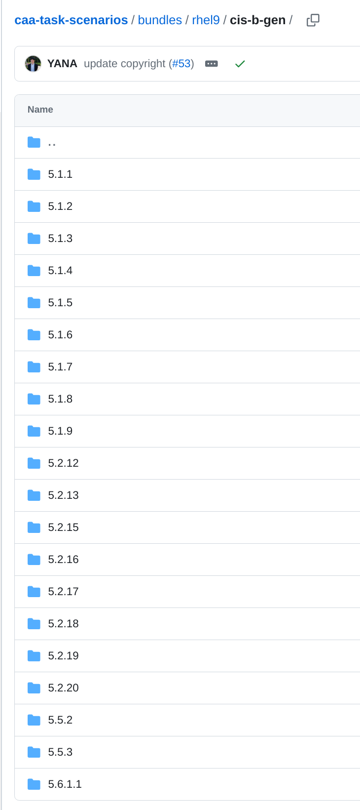

# End-to-End Demo: Compliance as Code CIS Benchmarks Catalog (snippet)
End-to-End Demo: Compliance as Code CIS Benchmarks Catalog (snippet)

This repo comprises OSCAL catalog for the end-to-end demo. The OSCAL catalog is for CIS Benchmarks, but for proprietary reasons only a portion (snippet) of the entire catalog is used for this demo.

The full catalog can be obtained from [CIS Controls OSCAL Repository](https://www.cisecurity.org/insights/blog/introducing-the-cis-controls-oscal-repository).

The [demo overview](https://github.com/oscal-compass/e2e-demo).

##### Notes

1. data/CIS_Red_Hat_Enterprise_Linux_9_Benchmark_v1.0.0.xlsx is snippet from complete CIS Benchmark
2. data/oscap.csv provided by Vikas
3. data/Makefile creates:
    - component-definitions/RHEL9-1.0.0/component-definition.json (software from CIS Benchmark snippet)
    - component-definitions/oscap/component-definition.json (validation from oscap))
4. Automations fixed by changed GIT_TOKEN to GITHUB_TOKEN
5. Markdown is not generated or assembled due to: `if [ "$compdef" != "IBM_FS_FR_COMBINED" ]; then`

##### CTP rules

Remarks: 

    - 5.1.1 has no CIS Controls

